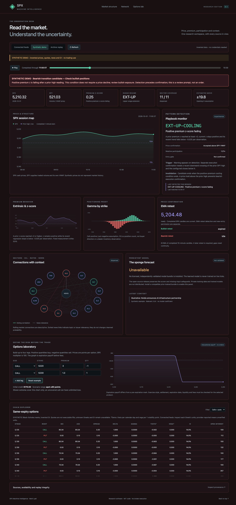

# SPX 0DTE Options Analysis and ML

An open-source local options-research dashboard accompanying **0DTE Options Decoded** and **0DTE Options Engineered**, by **Mark Lyall**. Both books focus on SPX, with SPY market context.

Public companion code: **https://github.com/hlyall/spx-0dte-options-analysis-ml**. The two books are separately copyrighted publications; this repository contains the software, documentation and executable mathematical examples.

The dashboard separates price observations, option sensitivities, rule-based playbooks and experimental model forecasts. It supports public/configured feeds, an explicit synthetic demonstration, and playback of locally archived observations. The separate historical downloader uses the same provider connections.



## Start the dashboard

Requires **Node 22.18 or newer**. Node 24 is also supported. From this directory:

```sh
git clone https://github.com/hlyall/spx-0dte-options-analysis-ml.git
cd spx-0dte-options-analysis-ml
npm ci
npm start
```

Open **http://127.0.0.1:8787**. The app listens on loopback by default. Its code, configuration, archive and port are independent of any other dashboard. There are no brokerage order or account-management methods.

The default view attempts the enabled public sources. Choose **Synthetic demo** to explore the complete interface without credentials; its invented bars, quotes and Greeks are labeled. A failed real feed never silently becomes synthetic data.

## Included features

- SPX/SPY price context and completed-bar historical playback.
- Reused, inspectable market-structure and premium-behavior calculations.
- Current and previous detected playbook, EMA retest observations and reversal attention.
- Descriptive range states: inside, gap above, gap below, upper extension, lower extension and two-sided expansion.
- Option-chain tables, a declared gamma proxy, and a multi-leg expiration-payoff laboratory.
- Eleven-sector context, oil/yield observations and rule-based news routing.
- Optional frozen model bundles with explicit validity and input-quality checks.
- Source identity, observation times, delays, availability and capability limits.
- Shared provider plugins and a separate resumable historical downloader.

See the [dashboard documentation](docs/dashboard.md) for feature parity, calendar configuration, model loading and migration boundaries. A feature can be present in code while remaining unavailable until its data or model requirements are met. The compact companion is not a pixel-for-pixel copy of the private application.

## Free and optional connections

| Connection | Default | Coverage |
|---|---|---|
| Yahoo chart | Enabled | Best-effort stock/index bars; precise delivery delay is unknown |
| Stooq | Enabled | Daily bars; access may be blocked by the provider |
| FRED | Enabled | Daily ten-year Treasury yield; not intraday TNX |
| Federal Reserve RSS | Enabled | Official Fed releases; not comprehensive company news |
| Theta Terminal v3 | Optional | Entitled index/stock/option data and bounded option history |
| Tradier | Optional | Account/token-dependent data; sandbox delays and restrictions apply |

No included no-key source guarantees a usable SPX option chain or historical intraday chain archive. Those real-data panels remain unavailable until an appropriate connection is supplied. There is no claim of a complete free consolidated feed.

The default configuration is `config/providers.default.json`. A private `config/providers.json`, `SPX_FEED_CONFIG`, or supported environment variables can supply your connections. Example:

```sh
THETA_BASE_URL=http://127.0.0.1:25503/v3 npm start
```

This reads an already-running, user-configured terminal. It does not launch or modify it. See [feed capabilities and plugin contract](docs/feeds.md). Provider terms and exchange entitlements still apply; MIT does not license their data for redistribution.

## Historical downloader

The downloader runs independently of the dashboard:

```sh
npm run providers
npm run download -- --kind bars --symbols SPX,SPY --date 2026-09-30 --interval 1m
```

Dates above demonstrate syntax. Choose a date supported by your provider's current lookback. Files go to the ignored `data/downloads/` directory with request manifests, timestamps, hashes and resumable status. Existing downloads are checked before being skipped. Provider failures stay recorded as unavailable.

To download one historical option contract using an entitled Theta connection:

```sh
THETA_BASE_URL=http://127.0.0.1:25503/v3 npm run download -- \
  --provider theta --kind option-history --symbol SPXW \
  --date 2026-09-30 --expiration 2026-09-30 \
  --strike 7700 --right CALL --interval 1m
```

This is a bounded example, not a recommended trade or a claim that the contract is currently available. Snapshots cannot be backdated into an invented historical chain. [Downloader and archive documentation](docs/downloader.md) covers source selection, resumption, return codes and replay constraints.

## 0DTE Options Decoded

*A Practical Guide to SPX Trading, the Greeks, and Machine Intelligence* · With SPY Market Context

This beginner and intermediate volume explains contract mechanics, Greeks, defined-risk structures, execution and how to interpret analytical tools. The research reports negative and inconclusive findings as well as implementation lessons; the experimental network additions did not establish an options-trading edge.

The books and portable dashboard use descriptive range and candidate names.
Source-inspired ideas remain attributed in the references; the names do not
claim a newly invented trading method.

## Develop and verify

```sh
npm test
npm run typecheck
npm run build
```

Tests use synthetic fixtures. Network probes are separate because outside providers can be delayed, unavailable or entitled differently. GitHub Actions checks the code on Node 22 and 24. See [contribution guidance](CONTRIBUTING.md) and [security boundaries](SECURITY.md).

```text
apps/dashboard/       Local server, interface and reusable analysis engines
packages/market-data/ Provider contract, adapters, normalization and archive reader
tools/downloader/     Independent historical command-line tool
config/               Credential-free defaults and calendar examples
companion/examples/   MIT-licensed mathematics and data-contract examples
docs/                 Capability, provenance, migration and verification notes
```

## 0DTE Options Engineered

*The Mathematics, Code, and Models Behind SPX Trading Analytics* · With SPY Market Context

The technical companion explains the implementation, mathematical models, data contracts, replay, missing-input inference and research evaluation. Its [executable examples](companion/examples/) are included here under MIT. Run them with `npm run test:examples`; the full manuscript and original book figures are distributed separately.

## License and publication scope

Software copyright © 2026 Mark Lyall, [MIT License](LICENSE). The manuscripts and original book figures retain their separate copyright and are not included in this code repository. Third-party source books, screenshots, licensed market records, credentials and private account data are not included. See [NOTICE](NOTICE).

This is a local research application. Publishing its source does not host a dashboard or market-data service. Experimental forecasts are research outputs, not proven trading returns.
